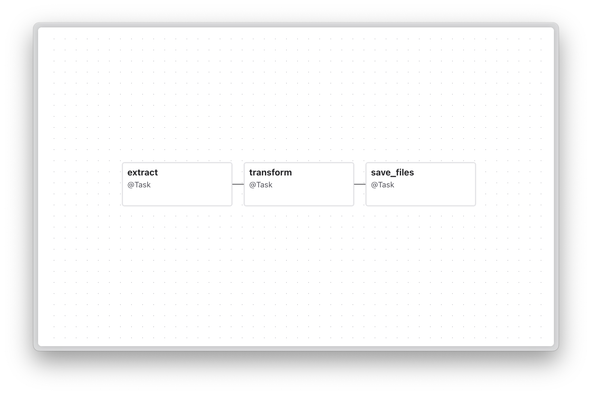

# Data Processing Pipeline with Apache Airflow and FastAPI

This project implements a data processing pipeline that receives data via API, transforms it, and outputs it in Excel and PDF formats.

## Dataflow Pipeline Graph



## Prerequisites

- Docker Compose

## Setup

1. Set up Airflow user permissions:
```bash
echo -e "AIRFLOW_UID=$(id -u)" > .env
```

2. Start the services:
```bash
docker-compose up -d --build
```

## API Usage

The API provides two endpoints:

### 1. Submit Data

```bash
curl -X POST http://localhost:8000/data \
  -H "Content-Type: application/json" \
  -d '[
    {"dataPoint": "e-5-3", "value": 134},
    {"dataPoint": "e-5-1", "value": 233},
    {"dataPoint": "e-2-3", "value": "text string"}
  ]'
```

### 2. Download Processed Files

```bash
# Download Excel file
curl http://localhost:8000/download/xlsx -o output.xlsx

# Download PDF file
curl http://localhost:8000/download/pdf -o output.pdf
```

## Stopping the Services

```bash
docker-compose down
```